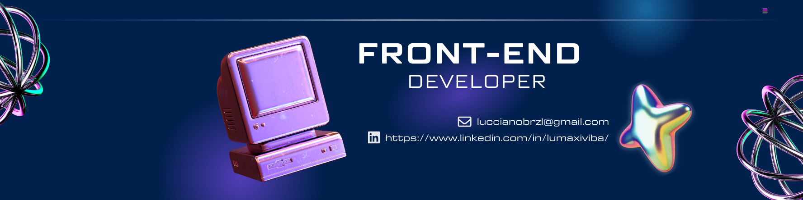

#   ¡Bienvenidos al Github de Lucciano Máximo!

	    	   
  

  Desarrollador dedicado a la programación frontend con la finalidad de resolver problemas y necesidades específica o generales de cada cliente, además destaco por mi constante formación y capacidad de adaptarme a cualquier entorno.

  ## Tecnologías
             	 

